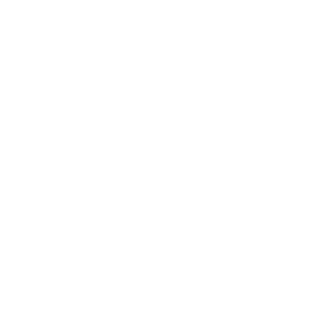

 
 

  
  <h3 align="center">C++ Simulated Andoks Ordering System</h3>

  This project is a **C++ console application** designed to simulate an ordering system for Andoks. It offers functionalities to view a menu, choose from appetizing dishes, order drinks, and review your order.

 

---

  
Table of Contents

  <ol>
    <li>
      <a href="#overview">Overview</a>
      <ol>
        <li><a href="#key-features">Key Features</a></li>
        <li><a href="#technology">Technology</a></li>
      </ol>
    </li>
    <li><a href="#roadmap">Roadmap</a></li>
    <li><a href="#resources">Resources</a></li>
  </ol>

---

## Overview

This C++ console application simulates an ordering system for **Andoks**, providing an easy-to-use interface for selecting dishes, drinks, and reviewing orders.

### Key Features

- **Menu Listing:** Displays a categorized menu of dishes, including appetizers and drinks.
- **Ordering System:** Allows users to select multiple items from the menu and add them to their order.
- **Order Review:** Provides a summary of the items ordered before confirming the purchase.
- **Clear and Intuitive Interface:** Ensures seamless interaction with the system.

### Technology

---

## Resources

| Title                      | Purpose                                       | Link                                        |
|----------------------------|-----------------------------------------------|---------------------------------------------|
| C++ Documentation          | Reference for C++ language features           | https://cplusplus.com/doc/                  |
